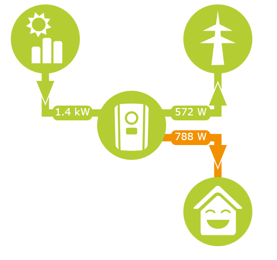

# KostalWebApi
Very Minimalistic Webapi for Kostal Plenticore Plus Photovoltaics Appliance

# Function

My Goal was to create a very barebones WebApi with which i could recreate this Frontend with some simple html, css and js:



# Alternative Frontend

You can build you own frontend for you WebApi, you can take this Repository as a Reference:

[Minimalistic Frontend for KostalWebApi by NIEI](https://github.com/NicoNewsHD/KostalWebApiFrontend)

# Installation / Deployment

## Docker
You can deploy this WebApi via a Docker compose script:
```yaml
version: "3.9"

services:
  web:
    image: niei/kostalwebapi:latest
    container_name: kostalwebapi
    network_mode: bridge
    ports:
      - 1024:80
    volumes:
      - ./data/appsettings.json:/app/appsettings.json:ro
    restart: always
```
### Sample appsettings.json
```json
{
  "Logging": {
    "LogLevel": {
      "Default": "Information",
      "Microsoft.AspNetCore": "Warning"
    }
  },
  "AllowedHosts": "*",
  "KostalPlenticoreIpAddress" :  "192.168.1.123"
}
```
